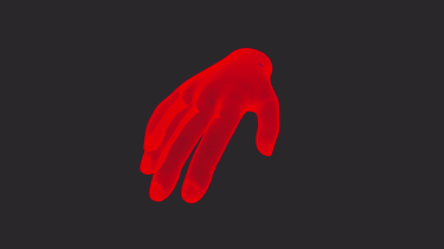
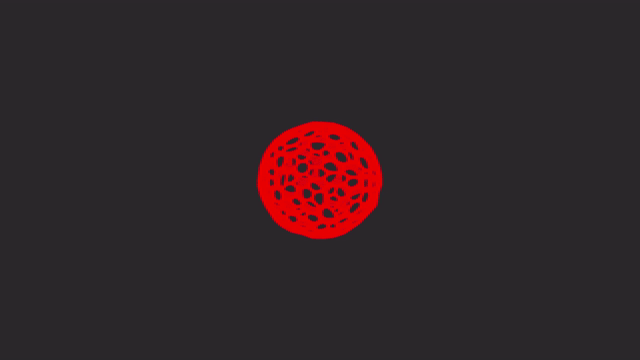

# Geometric Flow Modeling.

## Overview.

Implementation and visualization of various discrete geometric flow algorithms from the field of [differential geometry](https://en.wikipedia.org/wiki/Differential_geometry). Written in C, using [OpenGL](https://www.khronos.org/about/), for high-performance rendering.

## Features.

-   [Mean Curvature Flow](https://en.wikipedia.org/wiki/Mean_curvature_flow): this geometric flow evolves a manifold over time based on its mean curvature, or in our case, a mesh in the direction of its discrete analogue of mean curvature. This flow is used in surface smoothing and topology optimization, among other applications.
-   Camera modes--free, rotate, and lock--enable users to navigate space with keyboard and mouse, automatically rotate around objects for cinematic angles, or lock their position for stable shots.
-   Dynamic geometry.
-   Heat mapping is used to represent curvature and flow intensity, as well as provide pretty visuals. Red represents higher curvature, and blue represents lower curvature.
-   Object loading.
-   Modular design.

### Example of Heat Mapping on Hand Mesh.

### Example of Rotational Camera on Voronoi Sphere.

## Libraries.

## References and Inspirations.

## Usage.

## What I learned.

## Future Plans.

## Thank You.

Thank you for taking a look at my project! Have a good day!

