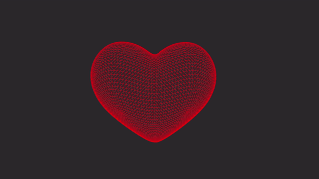

# Geometric Flow Modeling.

## Overview.

Implementation and visualization of various discrete geometric flow algorithms from the field of [differential geometry](https://en.wikipedia.org/wiki/Differential_geometry). Written in C, using [OpenGL 4.6](https://www.khronos.org/about/), for high-performance rendering.

## Features.

-   [Mean curvature flow](https://en.wikipedia.org/wiki/Mean_curvature_flow): this geometric flow evolves a manifold over time based on its mean curvature, or in our case, a mesh in the direction of its discrete analogue of mean curvature. This flow is used in surface smoothing and topology optimization, among other applications.
-   Camera modes--free, [rotate](#example-of-rotational-camera-around-voronoi-sphere), and lock--enable users to navigate space with keyboard and mouse, automatically rotate around objects for cinematic angles, or lock their position for stable shots.
-   [Heat mapping](#example-of-heat-mapping-on-hand-mesh) is used to represent curvature and flow intensity, as well as provide pretty visuals. Red represents higher curvature, and blue represents lower curvature.
-   Object loading: allows users to compute geometric flows on any .obj file. See how [here](#usage).

### Example of Heat Mapping on Hand Mesh.

### Example of Rotational Camera around Voronoi Sphere.

## Usage.

As mentioned previously, you can test out geometric flows on any .obj file as long as it has a triangulated mesh. I recommend using the following Blender export settings (or the equivalent in your software of choice) for the best results.

Once you've exported your .obj file, place it in `./models` and replace `#define MESH` with its location at the top of `app.c`. Finally, run `make && ./bin/app.exe` in your terminal to compile and execute the program.

\* Please note that this project was developed and has so far been tested exclusively on Windows. You may need to make some tweaks to run it on your operating system, though it should theoretically work fine. Also, the makefile is currently using GCC, so make sure the change that if you prefer a different compiler.

## Libraries and APIs.

-   [glad](https://github.com/Dav1dde/glad): OpenGL 4.6 function loader-generator.
-   [glfw](https://github.com/glfw/glfw): window and input handler.
-   [cglm](https://github.com/recp/cglm): mathematics library for computer graphics.
-   [fast_obj](https://github.com/thisistherk/fast_obj): obj parser.

## Future Additions.

-   .obj export functionality.
-   Infinite Cartesian coordinate grid.
-   More geometric flows (Gaussian curvature flow, Ricci flow).
-   Implemenation of surgery.
-   Texture options and pretty shaders.
-   Vertex selection system for more precise smoothing.

## Thank You.

Thank you for taking a look at my project! Hope you enjoyed!

